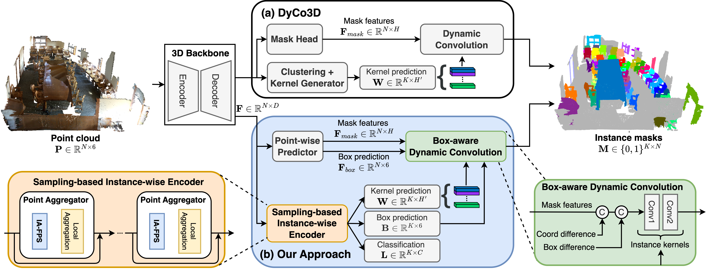

[](https://paperswithcode.com/sota/3d-instance-segmentation-on-scannetv2?p=isbnet-a-3d-point-cloud-instance-segmentation) 

[](https://paperswithcode.com/sota/3d-instance-segmentation-on-scannet200?p=isbnet-a-3d-point-cloud-instance-segmentation)

[](https://paperswithcode.com/sota/3d-instance-segmentation-on-s3dis?p=isbnet-a-3d-point-cloud-instance-segmentation)

[](https://paperswithcode.com/sota/3d-instance-segmentation-on-stpls3d?p=isbnet-a-3d-point-cloud-instance-segmentation)


##### Table of contents
1. [Features](#Features)
2. [Datasets](#Datasets)
3. [Installation](#Installation)
4. [Data Preparation](#Data-Preparation)
5. [Training and Testing](#Training-and-Testing) 
6. [Quick Demo](#Quick-Demo)
7. [Visualization](#Qualitative-Results)
8. [Acknowledgments](#Acknowledgments)
9. [Contacts](#Contacts)

# GaPro: Box-Supervised 3D Point Cloud Instance Segmentation \\Using Gaussian Processes as Pseudo Labelers

<a href="https://arxiv.org/abs/2303.00246"></a>

[Tuan Duc Ngo](https://ngoductuanlhp.github.io/),
[Binh-Son Hua](https://sonhua.github.io/),
[Khoi Nguyen](https://www.khoinguyen.org/)<br>
VinAI Research, Vietnam

> **Abstract**: 
Instance segmentation on 3D point clouds (3DIS) is a longstanding challenge in computer vision, where state-of-the-art methods are mainly based on full supervision. As annotating ground truth dense instance masks is tedious and expensive, solving 3DIS with weak supervision has become more practical. In this paper, we propose GaPro, a new instance segmentation for 3D point clouds using axis-aligned 3D bounding box supervision. Our two-step approach involves generating pseudo labels from box annotations and training a 3DIS network with the resulting labels. Additionally, we employ the self-training strategy to improve the performance of our method further. We devise an effective Gaussian Process to generate pseudo instance masks from the bounding boxes and resolve ambiguities when they overlap, resulting in pseudo instance masks with their uncertainty values. Our experiments show that GaPro outperforms previous weakly supervised 3D instance segmentation methods and has competitive performance compared to state-of-the-art fully supervised ones. Furthermore, we demonstrate the robustness of our approach, where we can adapt various state-of-the-art fully supervised methods to the weak supervision task by using our pseudo labels for training.


Details of the model architecture and experimental results can be found in [our paper](https://arxiv.org/abs/2303.00246v2):

```bibtext
@inproceedings{ngo2023gapro,
 author={Tuan Duc Ngo, Binh-Son Hua, Khoi Nguyen},
 booktitle={Proceedings of the IEEE/CVF International Conference on Computer Vision (ICCV)},
 title={GaPro: Box-Supervised 3D Point Cloud Instance Segmentation \\Using Gaussian Processes as Pseudo Labelers},
 year= {2023}
}
```

**Please CITE** our paper whenever this repository is used to help produce published results or incorporated into other software.

## Features :mega:
* State-of-the-art performance on ScanNetV2, S3DIS, and STPLS3D.
* High speed of 237ms per scan on ScanNetV2 dataset.
* Reproducibility code for both ScanNetV2, S3DIS and STPLS3D datasets.

## Datasets :floppy_disk:

- [x] ScanNetV2
- [x] ScanNetV2-200
- [x] S3DIS
- [x] STPLS3D

## Installation :memo:
Please refer to [installation guide](docs/INSTALL.md).

## Data Preparation :hammer:
Please refer to [data preparation](dataset/README.md).

## Training and Testing :train2:
Please refer to [training guide](docs/TRAIN.md).

## Quick Demo :fire:

### [ScanNetv2](https://kaldir.vc.in.tum.de/scannet_benchmark/semantic_instance_3d?metric=ap)

| Dataset | AP | AP_50 | Config | Checkpoint
|:-:|:-:|:-:|:-:|:-:|
| ScanNet test | 55.9 | 76.3 | 
| ScanNet val (paper) | 54.5 | 73.1 |
| ScanNet val | 56.8 | 73.3 | [config](configs/scannetv2/isbnet_scannetv2.yaml) | [checkpoint](https://drive.google.com/file/d/19FYLM5SzcQSKYR4r9iChauf5cleoXC_H/view?usp=drive_link) 
| ScanNet val (lightweight) | 50.1 | 68.9 | [config](configs/scannetv2/isbnet_lightweight_scannetv2.yaml) | [checkpoint](https://drive.google.com/file/d/1MOp2dq1KrJiTQxeLSbvTZX60CiUvAqcK/view?usp=share_link) 

### [ScanNetv2-200](https://kaldir.vc.in.tum.de/scannet_benchmark/scannet200_semantic_instance_3d)

| Dataset | AP | AP_50 | Config | Checkpoint
|:-:|:-:|:-:|:-:|:-:|
| ScanNet200 val | 23.7 | 31.5 | [config](configs/scannet200/isbnet_scannet200.yaml) | [checkpoint](https://drive.google.com/file/d/1ZEZgQeT6dIakljSTx4s5YZM0n2rwC3Kw/view?usp=share_link) 


### [S3DIS](http://buildingparser.stanford.edu/dataset.html)

| Dataset | AP | AP_50 | Config | Checkpoint
|:-:|:-:|:-:|:-:|:-:|
| Area 5 | 56.3 | 67.5 | [config](configs/s3dis/isbnet_s3dis_area5.yaml) | [checkpoint](https://drive.google.com/file/d/1oup4nEdgsmdwnMP1TQPmoIqZ8c1RoTgA/view?usp=share_link) 

### [STPLS3D](https://www.stpls3d.com/)

| Dataset | AP | AP_50 | Config | Checkpoint
|:-:|:-:|:-:|:-:|:-:|
| STPLS3D val | 49.3 | 64.0 | [config](configs/stpls3d/isbnet_stpls3d.yaml) | [checkpoint](https://drive.google.com/file/d/1EhPsl4003Y9HEycdFP0nYpoleEpQ2faJ/view?usp=share_link) 


Run evaluation with pre-trained models:

```
python3 tools/test.py <path_to_config_file> <path_to_pretrain_weight>
```
## Visualization :computer:
Please refer to [visualization guide](visualization/README.md).
We provide the qualitative results of our method at [here](docs/QUALITATIVE.md)

## Acknowledgements :clap:
This repo is built upon [SpConv](https://github.com/traveller59/spconv), [DyCo3D](https://github.com/aim-uofa/DyCo3D), [SSTNet](https://github.com/Gorilla-Lab-SCUT/SSTNet), and [SoftGroup](https://github.com/thangvubk/SoftGroup). 

## Contacts :email:
If you have any questions or suggestions about this repo, please feel free to contact me (ductuan.ngo99@gmail.com).